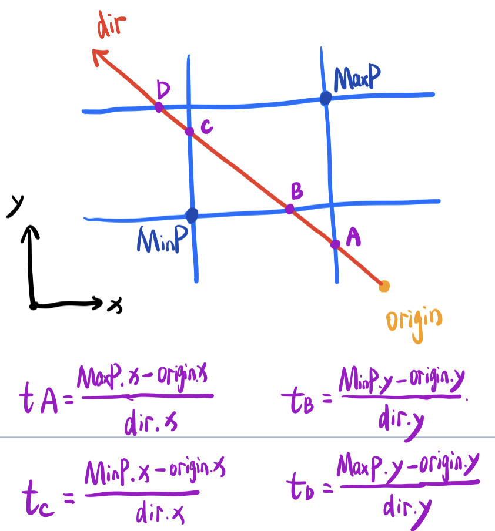
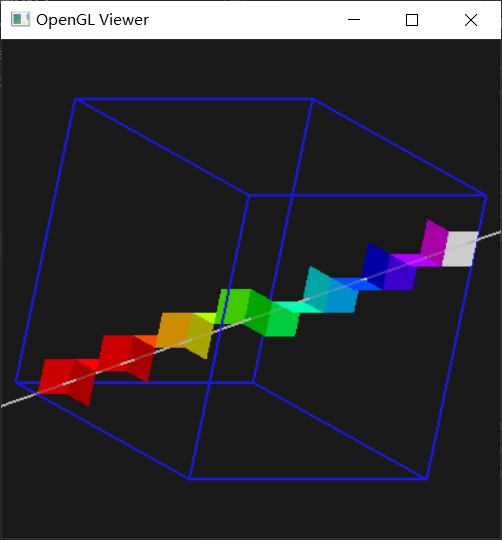
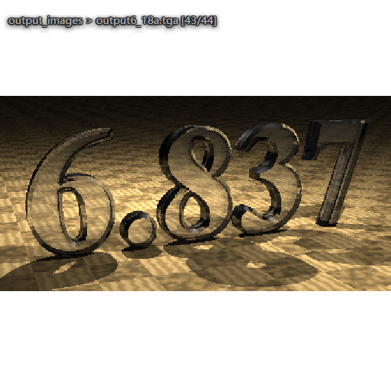
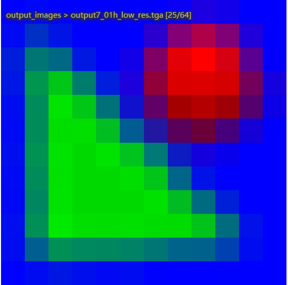
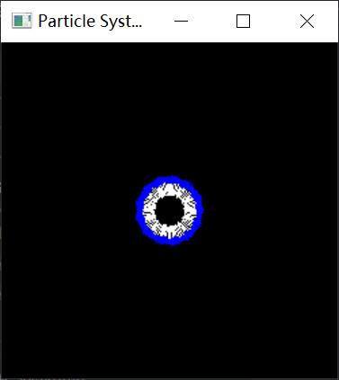
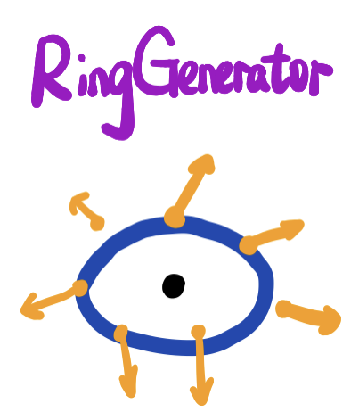
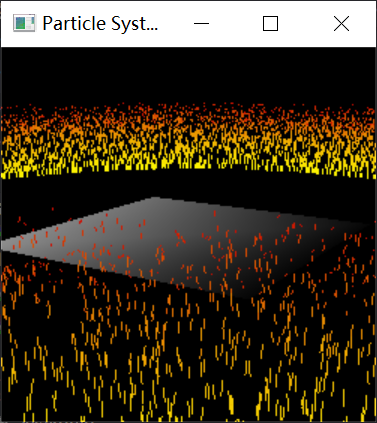
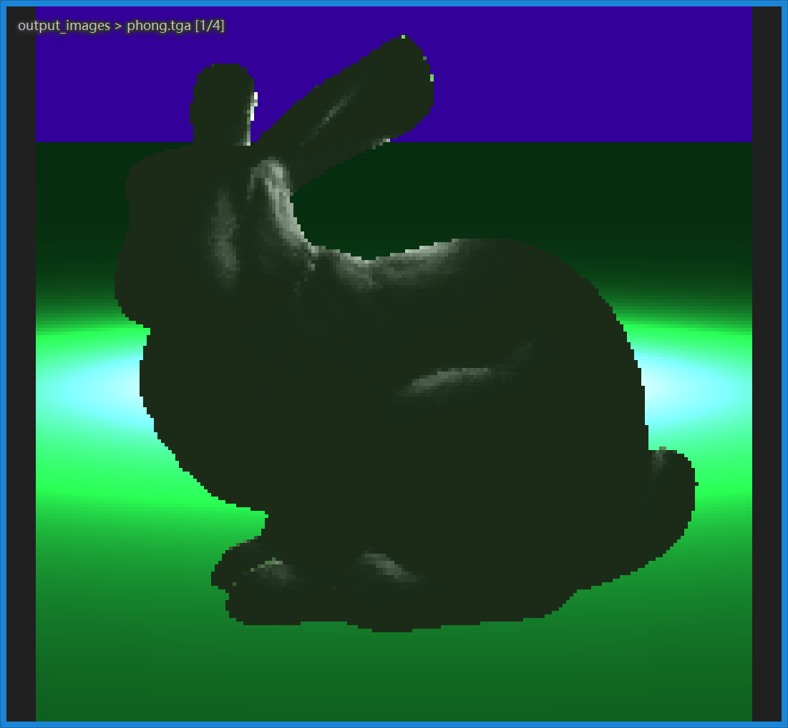

# MIT Graphics作业报告

## 简介

​	该报告是在MIT 6.837计算机图形学课程作业完成的基础上，提炼实现的具体思路而形成的作业报告。

## Assignment0-迭代函数系统IFS（分形）

​	作业0主要目的是对C++基础知识的熟悉与运用，并使用提供的一系列头文件作为工具搭建起一套系统，这套系统能够从命令行读取简单的渲染命令，并根据这些指令来完成单张图像的渲染。主要的工作除了IFS的搭建以外，还集中在利用迭代的函数来生成具有分形特点的几何图形上。

### 系统搭建

​	作业0的系统较为简单，可以用以下的流程图来表示：


①用户指令解析：将用户通过命令行输入的指令解析成内存中的变量。包括对输入文件的指定、随机点的个数、迭代的轮数、生成图片的尺寸及路径等；

②输入文件的解析：根据用户指定的输入文件，读取其中包含的多个矩阵及矩阵对应的概率，将possibilities、matrices都传递给IFS的构造函数，以创建IFS实例；

③IFS渲染生成分形图像：由Image模块创建空白的图像，交由IFS实例根据possibilities、matrices来确定随机点的位置；根据Configuration中指定的迭代次数和随机点总数，最终生成对应的分形图像；

### 分形图形生成

​	分形图形生成中最重要的一点是对任意一个随机点多次（通常数量级应在十以上）应用同一个矩阵变换，原来部分区域的点会逐渐收敛到同一个点附近，从而呈现出特定的分形图形效果，因此该部分实现的代码如下：

```c++
for(int i = 0; i < n_points; i++){ //总共有n_points个点
        Vec2f point = {get_random_nums(),get_random_nums()}; //生成一个随机点
        for(int j = 0; j < n_iteration; j++){ //对这个点进行n_iteration轮迭代
            Matrix transf = get_probability_based_matrix(); //根据概率随机获取一个矩阵
            transf.Transform(point); //应用矩阵的变换
        }
        image->SetPixel(point.x() * image->Width(),
                        point.y() * image->Height(),
                        Vec3f(0,0,0)); //绘制这个点对应的像素
    }
```

其中，随机数生成的函数如下：

```c++
//get random nums between [0,1]
float IFS::get_random_nums() { return (float)rand() / RAND_MAX; }
```

根据概率随机获取一个矩阵的实现如下图：


由于所有概率P之和为1，m的随机值为[0,1]，则根据m的长度映射到数组上，取出对应的变换矩阵即可。

最终程序对于各种分形图像的生成如下(仅挑选部分)：

### 结果展示

| 执行命令                                                     | 渲染效果                                                     |
| ------------------------------------------------------------ | ------------------------------------------------------------ |
| ifs -input fern.txt -points 50000 -iters 30 -size 400 -output fern.tga |  |
| ifs -input giant_x.txt -points 50000 -iters 30 -size 400 -output giant_x.tga |  |
| ifs -input dragon.txt -points 50000 -iters 30 -size 300 -output dragon.tga |      |


## Assignment1-Ray Casting(光线投射)

​	作业1主要实现RayCasting的完整过程，依次包括解析并创建场景和物体、创建平行投影的摄像机并投射光线、计算光线与场景的简单求交、利用求交信息进行着色（包括单一颜色着色和基于深度的着色）、最终将渲染结果保存为图片这五个步骤。

​	在对关键步骤进行介绍之前，先对整个程序的当前结构梳理如下：


​	在程序中实现了Object3D的接口，作为场景中出现的所有物体的公共父类，当前实现了Group类来管理多个Object3D对象、实现了Sphere类以创建场景中的球体，往后添加更多的3D物体对象时，继承Object3D并实现其中的纯虚函数即可。

​	同理，Camera接口的作用也是类似，作为场景中相机的基类，该次作业中完成正交投影相机的实现。

### 场景的解析和物体的创建

​	场景的解析由ScenePaser类来完成，它会接收用户的命令行参数输入，并从对应的输入文件中读取整个场景的信息（包括相机信息、材质信息、模型信息）：


### 由相机投射光线

​	在该部分，首先对生成图像尺寸的每个像素进行遍历，针对每个像素投射一根光线，让该光线同场景求交，并以返回的颜色值作为当前像素最终的颜色值，该逻辑的部分代码如下：

```C++
for(int j = 0; j < height; j++){ //两重循环遍历所有像素
        for(int i = 0; i < width; i++){
            Vec2f point = {(float)i/width,(float)j/height}; //当前点位置归一化[0,1]
            Ray ray = p->getCamera()->generateRay(point); //由正交相机创建光线
            //**** 光线与场景的求交&&根据颜色设置像素值 ****//
            
        }
    }
```

图解如下：


​	在图像空间，根据当前遍历到的像素坐标，可以构造出归一化的offset向量，接着在正交相机的虚拟平面上根据offset向量得到射线的起点Origin，再结合相机规定的朝向向量Dir即可得到当前相机投射出的光线Ray

### 光线与场景的求交&像素着色

​	由于作业1的场景仅存在球体，这里重点讨论光线与球体的求交，这一过程可以简化为求解一元二次方程的求解，在给定光源位置orig，光线方向dir，球心坐标center，球半径radius的情况下，考虑如下模型：


​	我们可以列出光线的矢量方程和球体的矢量方程：
$$
p=orig+t\cdot dir \\
\Vert p-center\Vert =radius
$$
​	联立上式可得关于t的一元二次方程：
$$
dir^{2} t^{2} +2dir\cdot ( orig-center) \cdot t+( orig-center)^{2} -radius^{2} =0
$$
​	令L=orig-center后，得到一元二次方程系数：
$$
\begin{cases}
a=dir^{2}\\
b=2\cdot dir\cdot L\\
c=L^{2} -radius^{2}
\end{cases}
$$
​	据此，可以考虑一元二次方程根的存在性问题来对应到光线与球体有几个交点：

1. 若方程没有根，则光线与球没有交点；
2. 若方程存在一个根，则根据根的正负以及是否相等，分为光线与球相切以及光源位于球内这两种情况；
3. 若方程存在两个根，则光线穿过了球体

   在上文生成光线的代码之后，调用Group的Intersect方法判断光线是否与场景中的物体相交，而Group则会调用它其中包含的所有Object3D物体的Intersect方法，这样一来，若光线与球体相交，球则会把自身的颜色信息返回，我们可以利用这个颜色信息写入到对应的像素中，部分代码如下：

```C++
if(p->getGroup()->intersect(ray,inter,tmin)){ //判断光线与整个场景中的物体是否相交
    										  //并把相交的信息存储在inter内
                Vec3f color;
                // obtain the color for this pixel
                assert(inter.getMaterial() != NULL);
                color = inter.getMaterial()->getDiffuseColor(); //直接获取颜色信息
             
                image->SetPixel(i,j,color); //直接将颜色信息写入像素
            }
```

​	此外，作业一还要求生成对应的深度图像，由于inter中包含了交点离光源的距离，场景中的光源又是平行光，我们便可以很方便地得到深度信息，再将其按照上下界Clamp作为灰度，即可得到对应的深度图像。部分代码如下：

```C++
	float depth = inter.getT();
    if(depth >= depth_min && depth <= depth_max){ //深度在规定的深度区间内
        float grayscale = (depth - depth_min) / (depth_max - depth_min);
        grayscale = 1 - grayscale; //离相机越近的颜色越亮
        Vec3f gray = Vec3f(grayscale,grayscale,grayscale);
        depthImage->SetPixel(i,j,gray); //将灰度写入最终颜色值
    }
```

### 结果展示

| 命令                                                         |                           渲染结果                           |                           深度图像                           |
| ------------------------------------------------------------ | :----------------------------------------------------------: | :----------------------------------------------------------: |
| raytracer -input scene1_02.txt -size 200 200 -output output1_02.tga -depth 8 12 depth1_02.tga |  |  |
| raytracer -input scene1_05.txt -size 200 200 -output output1_05.tga -depth 14.5 19.5 depth1_05.tga |  |  |
| raytracer -input scene1_07.txt -size 200 200 -output output1_07.tga -depth -2 2 depth1_07.tga |  |  |

## Assignment2 添加更多模型并应用模型变换

​	作业2中针对先前完成的简单raytracer，加入了更多功能的实现：考虑光照与表面法线的简单着色、透视投影的相机、平面以及三角形网格构成的三维模型、对模型进行的平移，缩放和旋转等变换。在上一次作业的基础上，程序的结构发生了增量更新：


​	场景中新增加了新的物体Plane、Triangle以及控制模型变换的Transform，同时场景中也支持透视投影的相机。

### 新增Object3D对象的实现

#### Plane

​	Plane表示三维场景中的平面，它由一根法线normal和距离坐标原点的距离offset来唯一确定，平面可以延展到无限远：


​	Plane与光线求交时，考虑如下的模型：


​	首先计算OA距离，OdotN=origion·normal，根据OdotN是否等于offset判断origin是否在平面内，在平面内则光线必定与平面相交，且这个时候的t值（光线从origin出发到打到平面的距离）为0；

​	当origin不在平面内部时，我们需要考虑DdotN=dir·normal，根据DdotN判断dir和normal间夹角是否大于0，仅当DdotN大于0时光线与平面才会产生交点。

​	计算光线与平面相交时的t值：AB段的长度为offset-OdotN，图中dir与normal的夹角为DdotN，根据三角函数可以得到t的值为：t = (offset-OdotN) / DdotN

#### Triangle

​	空间中的三角形是由它的三个顶点的坐标来进行定义的，这里直接说明光线与三角形求交的方法：


​	考虑空间中的点p，若该点为光线与三角形的交点，那么它应该既满足三角形的平面方程，又满足光线的射线方程：
$$
p=origin+t\cdot dir\\
p=v_{0} +\mu ( v_{1} -v_{0}) +\nu ( v_{2} -v_{0}) \notag
$$
​	联立两式，得：
$$
\begin{bmatrix}
E_{1} & E_{2} & -dir
\end{bmatrix}\begin{bmatrix}
\mu \\
\nu \\
t
\end{bmatrix} =S
$$
​	结合克莱姆法则以及三向量混合积可以解出u，v，t的值如下：
$$
\mu =\frac{( dir\times E_{2}) \cdot S}{( dir\times E_{2}) \cdot E_{1}} ,\nu =\frac{( S\times E_{1}) \cdot dir}{( dir\times E_{2}) \cdot E_{1}} ,t=\frac{( S\times E_{1}) \cdot E_{2}}{( dir\times E_{2}) \cdot E_{1}}
$$
​	当且仅当u，v的值在[0,1]内，u+v的值也在[0,1]内，并且t>tmin的情况下，光线才与三角形相交。

#### Transform

​	Transform主要实现对场景中的模型进行平移、缩放和旋转的操作，在作业框架的实现中，为了方便期间，Transform类并非对场景中的所有物体的世界坐标进行了变换，取而代之的，它对摄像机生成的光线进行了模型的逆变换，以生成的新光线与固定不动的场景进行求交，以达到完成模型变换的目的。

​	在Transform中，存储着一个包含所有模型变换的矩阵matrix，该矩阵能够将点在世界坐标系下进行变换。根据我们的思想，应该利用matrix的逆矩阵对每条光线进行遍历，包括光线的起点origin，以及它的方向dir：

```C++
	Vec4f homoOrigion = Vec4f(r.getOrigin(),1); //光源
    Vec4f homoDir = Vec4f(r.getDirection(),0);	//光线方向向量

    Matrix tempMatrix = matrix; // Do not bother the origin matrix.

    tempMatrix.Inverse();   // transform the object using "matrix" == transform the ray using "inverse matrix".
    tempMatrix.Transform(homoDir);  //transform ray-dir to object space
    tempMatrix.Transform(homoOrigion);  //transform ray-origin to object space
```

​	在变换完毕后，由于向量dir在变换过程中可能会被放缩，导致其变换后的长度并不为1，这一缩放会影响之后t值的大小，因此我们先记录下当前的长度作为放缩因子：

```C++
	float scaleCoefficient = newDir.Length();
```

​	在这之后，使用新的光线与场景进行求交的过程正常进行即可，若光线与场景相交，我们还需要对得到的t值除以放缩因子以得到真正的世界空间的t值：

```C++
	float newT = inter.getT() / scaleCoefficient;   //the true t
```

​	这其中还有一个值得注意的点，即物体表面的法线在经过模型变换之后未必同原来的表面垂直：


​	因此需要对法线进行特殊变换以保证变换后的法线仍垂直于表面。假设变换前的表面切线为t，法线为n，模型变换矩阵为M，法向量变换矩阵为S，有关系如下：
$$
\begin{cases}
n^{T} \cdot t=0\\
n^{^{\prime T}} \cdot t^{'} =0\\
t'=M\cdot t\\
n^{'} =S\cdot n
\end{cases}
$$
​	联立可以解得：
$$
S=\left( M^{-1}\right)^{T}
$$
​	因此，对法向量的变换应当采用S矩阵而非M来进行。

### 渲染流程的更新

​	在先前渲染流程的基础上，该次作业加入了简单的基于光照的着色，因此在判断光线与场景相交后，将相交的信息存储在inter中，并且针对场景中的所有光源进行简单漫反射着色的计算，最终像素的颜色即是各个光源着色结果的累加：

```C++
	// Go through all the lights in scene
    for(int k = 0; k < p->getNumLights(); k++){
        Light* L = p->getLight(k);	//第k个光源
        Vec3f lightDir,lightColor;
        L->getIllumination(inter.getIntersectionPoint(),lightDir,lightColor);
        NdotL = max(normal.Dot3(lightDir), 0.0f);	//计算光源与法线的夹角  
        lightSumColor += NdotL * lightColor * diffuse;	//单个光源的着色结果进行累加
    }
    Vec3f color = p->getAmbientLight() * diffuse + lightSumColor;	//Ambient Light
    image->SetPixel(i,j,color);	//将颜色值写入像素
```

### 透视投影相机的实现


​	同正交相机类似，根据当前像素在屏幕上的相对位置对应到虚拟屏幕（VirtualScreen）上的Origin点，再从透视投影相机的灭点和Origin间构造出单位化的dir向量作为光线的方向向量。

### 结果展示

| 命令                                                         | 渲染结果                                                     | 法线图像                                                     | 深度图像                                                     |
| ------------------------------------------------------------ | ------------------------------------------------------------ | ------------------------------------------------------------ | ------------------------------------------------------------ |
| raytracer -input scene2_06_plane.txt -size 200 200 -output output2_06.tga -depth 8 20 depth2_06.tga -normals normals2_06.tga |  |  |  |
| raytracer -input scene2_10_bunny_1k.txt -size 200 200 -output output2_10.tga |  |                                                              |                                                              |
| raytracer -input scene2_12_rotated_sphere.txt -size 200 200 -output output2_12.tga -normals normals2_12.tga |  |  |                                                              |
| raytracer -input scene2_16_t_scale.txt -size 200 200 -output output2_16.tga -depth 2 7 depth2_16.tga |  |  |                                                              |

## Assignment3-使用OpenGL对场景进行动态预览&Phong光照模型

​	作业3的主要内容是将OpenGL引入到我们的程序中，以实时运行的方式调用OpenGL的绘图函数对我们的场景进行绘制；实现可交互的相机脚本，支持用户对相机的平移、缩放和旋转操作；此外，作业中还实现了Blinn-Phong光照模型，相较于先前实现的简单着色，引入了更为柔和的高光效果。

### 引入OpenGL

​	配置好OpenGL的环境后，在使用RayCasting对场景完成渲染后，若用户给定了-gui的命令，则开始进行OpenGL图形化窗口的渲染。

​	创建GLCanvas对象的实例，并调用initialize()方法，即可初始化OpenGL。在初始化阶段，需要设置诸如OpenGL着色模型、显示模式等属性。接着指定我们对于键盘以及鼠标事件的处理函数，再将对场景进行渲染的函数传递给OpenGL，即完成了OpenGL的配置工作。

​	由于OpenGL中我们自定义的渲染函数会调用场景中所有物体的paint()方法以在OpenGL中绘制我们定义的Object3D物体，下面针对先前实现的各种Object3D物体各自的paint()方法进行说明：

#### group

​	group的paint()与先前的intersection()方法的思路一直，它并不需要绘制自己，因此它会遍历内部的所有Object3D物体，并依次调用他们的paint()方法

#### triangle

​	由于OpenGL中提供了绘制三角形的方法，我们只需要利用三点的坐标构造两个向量通过叉乘指定表面的法向量，再通过GL_TRIANGLES的指令进行三角形的绘制即可：

```C++
void Triangle::paint(void){
    m->glSetMaterial();
    
    Vec3f E1 = v1 - v0;	//向量AB
    Vec3f E2 = v2 - v0;	//向量AC
    Vec3f normal;
    Vec3f::Cross3(normal,E1,E2); //由逆时针的顶点顺序决定三角形的正面
    normal.Normalize();
    
    glBegin(GL_TRIANGLES);	//开始绘制三角形
        glNormal3f(normal.x(),normal.y(),normal.z()); //指定表面法线
        glVertex3f(v0.x(),v0.y(),v0.z());
        glVertex3f(v1.x(),v1.y(),v1.z());
        glVertex3f(v2.x(),v2.y(),v2.z());
    glEnd();
}
```

#### plain

​	对于无穷大平面绘制的思路，作业中采用OpenGL中对四边形的绘制命令GL_QUADS。为此我们需要找到在平面上相距非常远的四个点来近似无限大的平面。


​	为此我们先随意确定一个不与normal共线的向量m，使用m叉乘normal得到b1向量，此时b1向量一定位于平面内。再由b1和normal的叉乘构造出位于平面内且与b1垂直的b2向量，假定一个极大的长度L，那么沿b1、b2向量的正负方向L的距离可以确定位于平面上的四个点，经由这四个点便可以在OpenGL中近似渲染一个无限大的平面。

#### sphere

​	由于作业要求使用离散化的球体实现，因此考虑利用球面坐标系来将球面切分成多块区域并使用四边形来近似，将球体考虑如下：


​	根据球面坐标系，theta属于[-pi/2,pi/2]，phi属于[0,2*pi]，将其均匀分割后，如图中Δtheta和Δphi便可构成ABCD区域的球面，可以使用ABCD代表的四边形来近似球面。theta和phi的所有取值构成的四边形都渲染出来即可得到一个近似球体，theta和phi的范围被分割得越细，最终渲染结果就越接近球体。

#### transform

​	我们可以通过OpenGL提供的glMultMatrixf()方法来设置模型变换矩阵，对于transform对象，我们直接把它所包含的矩阵传递给OpenGL，在渲染过程中OpenGL会自动帮我们对场景内模型应用这个变换矩阵。这之后我们再调用内部物体的paint方法即可。

### 相机脚本的实现

​	实际上的相机脚本，即是在OpenGL渲染出来的窗口中可以通过用户的鼠标来控制相机的平移、缩放、旋转。下面以透视投影的相机为例说明相机脚本的实现：


#### 平移

​	这里所实现的平移是在垂直于透视投影相机中心线的平面内部进行平移。首先通过direction和up向量的叉乘构造出horizontal向量，再由horizontal和direction的叉乘构造处screenup向量，接着便可以通过OpenGL传递过来的用户鼠标在x和y方向移动的数值dx和dy来决定center平移后的位置。

#### 缩放

​	缩放过程将鼠标右键按下后的移动距离传递给dist，相机即在沿direction方向等比例地进行移动，实现相机离观看中心点的远近移动，可以在更近处或更远处观察整个场景。

#### 旋转

​	旋转时鼠标在x方向和y方向移动的微量为dx和dy。dx使相机水平地旋转，即在世界坐标系中绕up向量进行旋转，旋转角度由dx大小决定，可构造出旋转矩阵M1；dy使相机竖直地旋转，即在世界坐标系中绕当前的direction向量进行旋转，旋转角度由dy大小决定，可构造处旋转矩阵M2。将M1与M2相乘后得到rotateM矩阵，再使用这个矩阵对相机的center点和direction向量进行变换后得到新的center和direction。

### Blinn-Phong光照着色模型的实现

​	在本次作业中，由于实现了继承Material类的PhongMaterial实例，因此在着色过程中，除了上一次作业实现的漫反射部分，还加入了高光部分的计算。对于每个光源，都将光源信息传递给对应交点的Material类的Shade方法来计算出高光部分的大小，用于最终着色。


​	Blinn-Phong模型使用半程向量和normal的夹角来代替反射的视角向量同光线向量的夹角，在减少计算量的同时带来了更为柔和的高光效果，本次作业实现的计算specular的方式如下：
$$
specular=K_{s} \cdot L_{s} \cdot ( h\cdot normal)^{p}
$$
​	式中Ks为物体本身呈现的高光颜色，Ls为光照颜色，h为半程向量，p则为高光指数。

### 结果展示：

|                             命令                             |                          OpenGL预览                          |                           图片输出                           |
| :----------------------------------------------------------: | :----------------------------------------------------------: | :----------------------------------------------------------: |
| raytracer -input scene3_04_bunny_mesh_1k.txt -size 200 200 -output output3_04.tga -gui |  |  |
| raytracer -input scene3_08_sphere.txt -size 200 200 -output output3_08.tga -gui -tessellation 20 10 |  |  |
| raytracer -input scene3_08_sphere.txt -size 200 200 -output output3_08.tga -gui -tessellation 20 10 -gouraud |  |  |
| raytracer -input scene3_09_exponent_variations.txt -size 300 300 -output output3_09.tga -gui -tessellation 100 50 -gouraud |  |  |
| raytracer -input scene3_12_weird_lighting_specular.txt -size 200 200 -output output3_12.tga -gui -tessellation 100 50 -gouraud |  |  |

## Assignment4-全局光照&阴影

​	本次作业主要实现从raycasting到raytracing的转变，加入光线在场景中的多次弹射，实现反射与折射的材质类型，并引入物体阴影，同时在OpenGL实时预览窗口中加入光线传播路径的可视化。

### 光线的多次弹射

​	在先前的着色过程中，相机在每个像素发出一根光线，用这根光线与场景求交，在交点处计算得到的着色信息即被当成这个像素的颜色。而在全局光照中，光线在打到一个物体后会依据物体的材质特性发生反射或折射，这个时候像素的颜色应该要考虑反射或折射后光线继续传播直到同场景相交的着色信息——这是一个递归的过程，以反射为例：


​	根据上述流程，可以构造traceray()函数的伪代码如下：

```C++
Vec3f TraceRay(ray，bounce){
    if (bounce > maxbounce) return; //超过规定弹射次数的光线将被抛弃
    if (isIntersect) {	//光线与场景相交
        Vec3f color(0,0,0);
        if (isReflectiveMat) {	//该物体可以发生反射
            refRay = reflect(ray);	//构造反射光线
            color += TraceRay(refRay,bounce+1);	//沿反射方向递归调用，弹射次数+1
        }
        if (isTransmittedMat) {	//该物体可以发生折射
            tranRay = transmitted(ray);	//构造折射光线
            color += TraceRay(tranRay,bounce+1);	//沿折射方向递归调用，弹射次数+1
        }
        color += ShadeCurrent();	//在当前点进行着色
        return color;	//返回着色完毕的颜色
    } else return BackGroundColor;	//光线未与场景相交返回背景颜色
}
```

​	依据递归的思路我们便可以从光线同场景最后一次相交（图中C点）来往前计算着色了，最终着色信息依据权重累加到光线同场景第一次相交（图中A点），再写入到对应像素中，即可完成一个像素的着色。

​	下面对如何通过入射光线和法线计算反射光线和折射光线进行说明：

#### 反射

​	考虑入射光线incident和法线normal都是归一化的向量，则反射光线reflect可表示如下：


#### 折射

​		考虑如下图，构造由向量E，I，M构成的三角形，根据theta和alpha的三角函数及边之间的三角关系，上下平面的相对折射率n=sin(theta)/sin(alpha)，我们可以列出下列方程组：


$$
\begin{cases}
E=-cos\theta \cdot normal\\
M=I-E\\
S=M\cdot \frac{| S| }{| M| }\\
| S| =cos\theta \cdot tan\theta \\
| M| =sin\theta 
\end{cases}
$$
​	联立上式可得归一化的折射向量如下：
$$
Refracted_{normalized} =I\cdot \eta -( cos\alpha -cos\theta \cdot \eta ) \cdot normal
$$

### 阴影


​	阴影的实现基于这样一个简单的思路：倘若某个点处于阴影当中，那么光源对它来说会被场景中的其他物体遮挡，即它和光源的连线一定会与场景中的其他物体相交。因此在考虑着色时，针对每一个着色点，我们遍历所有的光源，并由着色点向光源发出一条光线，若光线与其他物体相交，则对于当前光源着色点是位于阴影中的，不再进行后续的着色操作。

### OpenGL实时预览光路

​	在作业框架提供的RayTree结构中，维护了一系列数组用于存储空间中的线段，线段分为主视线（一根描述相机direction的灰色线段）、反射线段（最多10根的红色线段）以及折射线段（最多10根的蓝色线段）。数组中存储着每根线段的起点和终点，在绘制的时候在起点和终点的位置各调用一次glVertex3f即可。

​	为了实现实时的绘制，我们需要在离线程序渲染的过程中往RayTree的各个数组中加入光线线段。以反射线段为例：在本节的raytrace()函数中，我们向光线的反射方向打出了一条新的光线，该光线显然属于反射线段，应当使用红色进行渲染，我们调用RayTree的AddReflectedSegment()方法往反射线段的数组中添加这一条光线。部分伪代码如下：

```C++
	```previous code```
	if (isReflectiveMat) {	//该物体可以发生反射
            refRay = reflect(ray);	//构造反射光线
            color += TraceRay(refRay,bounce+1);	//沿反射方向递归调用，弹射次数+1
        	AddReflectedSegment(refRay,0,refRayHit.getT())	//沿反射方向从起点开始直到打到													//其他物体的之间部分的线段都应该渲染
    }
	```back code```
```

### 结果展示

| 命令                                                         | bounce0                                                      | bounce1                                                      | 最多次bounce                                                 |
| ------------------------------------------------------------ | ------------------------------------------------------------ | ------------------------------------------------------------ | ------------------------------------------------------------ |
| raytracer -input scene4_04_reflective_sphere.txt -size 200 200 -output output4_04d.tga -shadows -bounces **n** -weight 0.01 |  |  |  |
| raytracer -input scene4_06_transparent_bars.txt -size 200 200 -output output4_06a.tga -shadows -bounces **n** -weight 0.01 -shade_back -gui |  |  |  |
| raytracer -input scene4_14_faceted_gem.txt -size 200 200 -output output4_14a.tga -shadows -shade_back -bounces **n** -weight 0.01 |  |  |  |

| 命令                                                         | OpenGL光线路径预览                                           |
| ------------------------------------------------------------ | ------------------------------------------------------------ |
| raytracer -input scene4_02_colored_shadows.txt -size 200 200 -output output4_02.tga -shadows -gui -tessellation 50 25 -gouraud |  |
| raytracer -input scene4_03_mirrored_floor.txt -size 200 200 -output output4_03.tga -shadows -bounces 1 -weight 0.01 -gui |  |
| raytracer -input scene4_09_transparent_sphere_2.0.txt -size 200 200 -output output4_09.tga -shadows -bounces 5 -weight 0.01 -shade_back -gui -tessellation 30 15 |  |

## Assignment5-体素渲染

​	作业5的内容十分有趣，主要实现一个空间中的三维网格，利用这一网格将三维模型离散化，如同连续的二维图形被离散化为二维的像素一般，网格将三维模型离散化为三维的体素——即网格中的每一个小立方体。

​	为了实现作业要求的体素渲染，在先前的程序中加入了包围盒的实现，随后为每一个Object3D物体添加了将其在网格中离散化的方法，利用3DDDA算法来快速计算光线与整个网格的求交，最后完成离线以及在线的体素渲染的实现。

### BoundingBox

​	所谓包围盒，即是一个最小的能完全包裹三维模型的长方体，它通常由长方体的所有顶点中，三维坐标值均取最小值和均取最大值的两个顶点进行定义，先前出现的所有Object3D物体对应包围盒做规定如下：


- Sphere：球体包围盒的最小坐标为球心坐标减去半径，最大坐标为球心坐标加上半径；
- Triangle：三角形包围盒的最小坐标为三个顶点中x，y，z各自最小值确定的点，最大坐标则为各自最大值确定的点；
- Group：包围盒的大小由其内部所有物体包围盒的并集决定：即最小坐标为所有物体包围盒坐标的最小值；最大坐标为所有物体包围盒坐标的最大值；
- Plane：由于程序中实现的平面是无限大且不具有厚度的，因此考虑准确性无法指定其对应的包围盒；
- Transform：对于Transform内部的物体，其具有对应的包围盒，将包围盒的八个顶点使用matrix进行变换，最终得到变换后的顶点构成的包围盒即为Transform自身的包围盒。

### Grid的实现


​	首先，Grid实际的大小为场景中包含所有物体的包围盒（即最外层Group对象的包围盒）。在这个包围盒的基础上根据用户的指令进行x，y，z轴的分割，从而形成多个称之为Cell的小室，我们的体素渲染即是用这一个个的Cells去近似物体原本的模型。由于已知包围盒的最小点MinP、最大点MaxP以及x，y，z方向上Cell的单位长度，因此针对场景中的任意一个点，我们可以计算得到它对应所处的Cell；同理，针对任意一个index代表的Cell，我们也可以计算得到其Cell对应的空间坐标：

```C++
	//由空间点计算对应Cell的index
	int indexX = (position.x - MinP.x) / dx;
	int indexY = (position.y - MinP.y) / dy;
	int indexZ = (position.z - MinP.z) / dz;
	int index = indexX * LengthY * LengthZ + indexZ * LengthY + indexY;
	Cells[index];	//通过index获取对应Cells的内容

	//由Cell的index计算对应空间坐标
	Vec3f o = MinP + Vec3f(indexX * dx, indexY * dy, indexZ * dz);
```

### 将模型添加进Grid

​	上述所提到的拥有BoundingBox的物体都可以被插入进网格，所谓的插入网格是指将模型本身的指针加入到它所占据的所有Cell内部维护的指针数组中，Grid中的每一个Cell都维护一个Object3D类型的指针数组。

#### Triangle

​	将空间的三角形插入Grid的思路十分简单，我们放宽松判断的条件，以三角形包围盒所占据的所有Cells近似当作三角形占据的Cells，向这些Cells中加入当前三角形的指针即可：

```C++
	Vec3i begin = getGridIndex(this.BB.getMinP());	//三角形包围盒最小坐标对应Grid索引
	Vec3i end = getGridIndex(this.BB.getMaxP());	//三角形包围盒最大坐标对应Grid索引
	for(int x = begin.x; x <= end.x; x++)
        for(int y = begin.y; y <= end.y; y++)
            for(int z = begin.z; z <= end.z; z++){
                int index = x * LengthY * LengthZ + z * LengthY + y;
                g->addCellObject(index,this);	//在包围盒占据的所有Cells中添加三角形的指针
            }
```

#### Sphere

​	对球体的插入则更加严格，考虑球体包围盒所占据的所有Cells，当且仅当每个Cell至少有一部分在球体内部时，我们才认为这个Cell是被球体占据的，此时才将球的指针添加到Cell内部的指针数组中：

```C++
	Vec3f minP = this.BB.getMinP(), maxP = this.BB.getMaxP(); //包围盒最小坐标和最大坐标
	Vec3i begin = getGridIndex();	//三角形包围盒最小坐标对应Grid索引
	Vec3i end = getGridIndex();	//三角形包围盒最大坐标对应Grid索引
	float dL = 0.5f * sqrt(dx*dx + dy*dy + dz*dz);	//单个Cell对角线长度的一半
	for(int x = begin.x; x <= end.x; x++)
        for(int y = begin.y; y <= end.y; y++)
            for(int z = begin.z; z <= end.z; z++){
                Vec3f cellCenter = Vec3f(minP.x + x*0.5*dx,
                                         minP.y + y*0.5*dy,
                                         minP.z + z*0.5*dz);
                if ((cellCenter-center).Length() < radius + dL) {//Cell重心距离球心的距																	//离小于半径+半对角线
                    int index = x * LengthY * LengthZ + z * LengthY + y;
                    g->addCellObject(index,this);	//只在包含一部分球的Cells中添加指针
                }
            }
```

#### Group

​	对于Group的做法同往常一样，我们只需要遍历它包含的所有物体并依次调用它们的插入方法即可。

#### Transform

​	Transform对象在调用它内部物体的插入方法之前，会现将它拥有的矩阵matrix同时传入插入方法，因此在上述物体进行插入前，需要先使用matrix对自身进行变换，以获得变化之后的包围盒再进行插入：

```C++
void Transform::insertIntoGrid(Grid *g, Matrix *m){
    Matrix *newMatrix;	//创建新矩阵
    if(m == NULL) newMatrix = new Matrix(matrix);
    else newMatrix = new Matrix(*m * matrix);	//累乘现有矩阵
    obj->insertIntoGrid(g,newMatrix);	//传递到内部Object3D的插入方法中
}
```

### 3DDDA

​	用户可通过命令行中的-visualize_grid命令来进行网格的渲染，由于渲染时我们仅渲染那些内部包含有物体的Cells，因此在整个Grid中，快速判断一条光线穿过了哪些Cells是十分关键的（这一过程在离线和实时的两种版本的渲染都是核心），本次作业采用3DDDA算法来实现光线和网格的快速求交。

​	3DDDA算法是DDA算法的三维版本，即通过增量的方式来沿光线从当前体素移动到下一个体素，直到到达Grid的边界。在程序中的实现分为两个部分：


​	Part1：光线从光源出发打到Grid表面上；

​	Part2：光线在Grid内部增量移动

#### Part1

​	这一部分可以利用包围盒的性质来求得光线是否与Grid相交并求出交点的位置：



​	如图，以二维情景为例，光线在穿过包围盒时，必定会与包围盒延伸出来的四条直线有四个交点，在A，B，C，D四个点中，我们取x，y方向t值最小的两个点，他们的最大值即是光线与包围盒第一次相交的交点，此时t值记为t_enter；同理，取x，y方向t值最大的两个点，他们的最小值即是光线离开包围盒的交点，此时t值记为t_exit；若t_enter > t_exit或是t_exit<0则说明直线不与包围盒相交。三维情形下的部分伪代码如下：

```C++
	Vec3f tMin = Vec3f(
        min((minP.x() - origin.x()) /dir.x(), (maxP.x() - origin.x()) / dir.x()),  
         min((minP.y() - origin.y()) /dir.y(), (maxP.y() - origin.y()) / dir.y()),
          min((minP.z() - origin.z()) /dir.z(),(maxP.z() - origin.z()) / dir.z()));
    Vec3f tMax = Vec3f(
        max((minP.x() - origin.x()) / dir.x(),(maxP.x() - origin.x()) / dir.x()),
         max((minP.y() - origin.y()) / dir.y(),(maxP.y() - origin.y()) / dir.y()),
           max((minP.z() - origin.z()) / dir.z(),(maxP.z() - origin.z()) / dir.z()));
	 float tEnter = max(tMin.x(),max(tMin.y(),tMin.z()));	//进入包围盒的t值
     float tExit = min(tMax.x(),min(tMax.y(),tMax.z()));	//离开包围盒的t值
     if(tExit < tEnter || tExit < tmin) {    //光线不与包围盒相交
            return;
     }
```

#### Part2


​	这一部分需要我们沿着光线的路径来定位其经过的所有Cell，首先根据pos的位置确定当前的Cell索引，那么下一步我们移动到的必定是与这个Cell相邻的其他Cell，我们只需要作出向哪一个Cell移动的决策就好。这一决策可以依据以下的判断作出：计算沿光线的dir方向，哪一个方向离下一个Cell更近，根据pos的三维坐标，我们可以得到下一次经过的Cell的表面在三个坐标轴方向分别值为nextx，nexty，nextz。三个方向的t值可以表示为:
$$
\begin{cases}
t_{x} =( nextx-pos.x) /dir.x\\
t_{y} =( nexty-pos.y) /dir.y\\
t_{z} =( nextz-pos.z) /dir.z
\end{cases}
$$
​	比较tx,ty,tz的大小，最小的t值即表示当前位置pos沿dir走t的距离即到达下一个点next，此时将next对应到Grid的索引即可确定是哪一个Cell，至此完成了一次增量移动。

​	不断执行上述Part2的过程，直到光线离开Grid，即可将Grid中沿光线经过的Cell全部遍历到。

### 离线体素渲染&实时体素渲染

运用先前一系列作业中实现的raytracer来进行网格的渲染即为离线体素渲染，而在OpenGL中实现的实时预览即为实时体素渲染，两者的实现采用不同的思路：

#### 离线体素渲染

​	离线体素渲染在raytracer的基础上利用3DDDA算法找寻到每根光线首次打到的不为空的Cell，随后在打到的表面进行常规的着色操作，这个时候，我们实际上没有生成Grid的实体，而是基于Cell不为空的这一判断勾勒出一个体素的外壳，但这一外壳用于着色也足够了。

```C++
	if(g->intersect(ray,hit,tmin)){	// 关键在于Grid的intersect方法，它将ray第一次打到的										Cell的表面信息存储在hit中，用于后续的着色
        shade();
	}
```

​	而Grid的intersect方法伪代码如下：

```C++
	bool intersect(const Ray &r, Hit &h, float tmin){
        MarchingInfo mi;
        initializeRayMarch(mi,r,tmin);	//初始化求交流程
        int indexI = mi.getGridIndexI();
        int indexJ = mi.getGridIndexJ();
        int indexK = mi.getGridIndexK();
        int index = (int)(indexI * nVector.y() * nVector.z() + indexJ * nVector.z() + indexK);
        bool isHit = false;	// 光线是否打到Grid
        while(InsideGrid()){
            // 下面if语句只执行一次，用于离线体素渲染
            if(isFirstHitGrid){	//当前网格是第一个被光线打到的网格
                isHit = true;
                h.set(currenT,ColorScheme.getcolor(numObjects),normal,r);
            }
            // 接下来while循环，用于实时体素渲染
            mi.nextCell();	//移动到下一个网格
            indexI = mi.getGridIndexI();
            indexJ = mi.getGridIndexJ();
            indexK = mi.getGridIndexK();
            index = (int)(indexI * nVector.y() * nVector.z() + indexJ * nVector.z() + indexK);
        }
        return isHit;	//返回光线是否达到Grid
    }
```

#### 实时体素渲染

​	可视化网格部分，我们的实现思路比较简单，对Grid的所有Cells进行一次遍历，一旦某个Cell不为空，那么就调用六次GL_QUADS命令来把Cell的六个面绘制到画面上，颜色采用自定义的ColorScheme，若Cell内部的Object3D越多，它的颜色会越偏向红色：


​	可视化路径部分，我们在使用3DDDA算法遍历Grid时，每遍历一个Cell，就把它的六个面绘制到画面上，这里绘制颜色是由次序决定的，光线越后经过的Cell颜色会越偏红：


​	可视化进入面元部分，同可视化路径部分类似，遍历Cell时，我们仅绘制光线进入Cell时打到的那个面，绘制颜色同样由次序决定，光线越后经过的Cell颜色会越偏红：



### 结果展示：

| 命令                                                         | OpenGL预览                                                   | 渲染结果                                                     |
| ------------------------------------------------------------ | ------------------------------------------------------------ | ------------------------------------------------------------ |
| raytracer -input scene5_01_sphere.txt -size 200 200 -output output5_01c.tga -gui -grid 15 15 15 -visualize_grid |  |  |
| raytracer -input scene5_04_plane_test.txt -size 200 200 -output output5_04.tga -gui -grid 15 15 15 -visualize_grid |  |  |
| raytracer -input scene5_12_nested_transformations.txt -size 200 200 -output output5_12.tga -gui -grid 30 30 30 -visualize_grid |  |  |

## Assignment6-网格加速的光线追踪&随机纹理生成

​	作业6中，我们利用作业5实现的Grid来加速光线追踪的过程：我们仅计算光线经过的Cells中物体与光线的求交，而非先前计算场景中的所有物体同光线的求交，对于复杂的场景，这一过程简化的计算量是十分可观的，可以在后文的渲染数据统计部分感受到加速结构对渲染效率的提升；此外，本次作业中还实现了程序化生成的纹理，以棋盘型纹理为基础，模拟了大理石、木头的纹理。

### 利用网格加速光线与场景求交

​	在构建网格的基础上，使用网格加速光线与场景的求交同作业5中遍历光线穿过的Cell思路类似，但由于需要考虑Cell内部具体的物体，仍有一些细节需要处理。

​	利用上节所述的3DDDA算法的主要思路，我们利用网格加速的光线求交的FastRayCast()方法主要分为以下几个部分：

#### 光线与网格之外的物体求交

​	在我们考虑Grid之前，场景还存在一个未被我们加入进Grid的物体，即代表平面的Plane，由于其无限大的特性，加入Grid会使其同样变得无限大，这样一来就失去了利用网格进行加速的意义，因此Plane无法加入Grid。这里我们只能采用遍历所有Plane的方法来进行光线与其求交的过程。

（注：在Plane的insertIntoGrid()方法即插入网格的方法中，可以把自己添加到Grid维护的infinitePrimitives数组中，这样调用FastRayCast()方法时我们便可以直接遍历infinitePrimitives数组来求光线与场景中所有平面的交点。）

```C++
	bool fastIntersect (const Ray &r, Hit &h, float tmin) { //利用网格加速的光线与场景求交
        bool ans = false; //返回值，若光线与任意物体相交则返回值ans应为true
        
        // 光线与平面求交，infinitePrimitives中存储了场景中所有平面
        for (int i = 0; i < infinitePrimitives.getNumObjects(); i++) {
            if(infinitePrimitives.getObject(i)->intersect(r,h,tmin))ans = true;
        }
```

#### 光线与网格内部物体求交

​	该部分可参照作业5给出的方法依次遍历光线穿过的Cell，针对每个Cell，对其内部的所有物体进行光线与其的求交，但需要考虑下图的情况：


​	在沿光线穿过的Cells中，按照从origin出发的方向，我们首先在Cell0中获取到绿色三角形，并且求得绿色三角形与光线的交点为A，但需要注意，由于A点并不位于Cell0内部，我们并不能断定此时A点就是光线首先打到的点，倘若按照上图的情况，显然光线下一次打到橙色三角形上的B点才是距离光源更近的点，因此在这一次光线与场景求交的结果我们应该返回B点处的相交信息。

​	也就是说，当在Cell中计算得到内部的物体与光线有交点时，将这个交点记为A，则我们仍需遍历当前Cell到A点所在的Cell之间的Cells，倘若期间再没有其他交点，那么才可断定A点为光线首次打到场景中物体的点，否则应让期间距离光源更近的交点来作为求交的结果。

​	此外，由于一个物体可能占据多个Cell，我们在遍历光线沿途的Cells时，不应该重复求交光线和同一个物体，程序中的实现可以设置一个集合Set，每次进行完毕光线和一个物体的求交，无论相交与否，都将这个物体添加进这个集合，此后每次遍历Cell中的物体时，对于Set中存在的物体我们不再考虑。

​	代码方面我们将作业5中的遍历方法改造如下：

```C++
		MarchingInfo mi; //存储光线步进的信息
		bool ans = false;
        initializeRayMarch(mi,r,tmin);	//初始化求交流程
        int indexI = mi.getGridIndexI();
        int indexJ = mi.getGridIndexJ();
        int indexK = mi.getGridIndexK();
        int index = (int)(indexI * nVector.y() * nVector.z() + indexJ * nVector.z() + indexK);
        Object3DVector check; //存储已经求交过的物体
        while(InsideGrid()){
            //遍历当前Cell中的所有物体
            for (int i = 0; i < cells[index].getNumObjects(); i++) {
                currObj = cells[index].getObject(i); //取出一个物体
                if (!check.hasObject(currObj)) {  //物体还未求交过
                    Hit hit;
                    if (currObj->intersect(r,hit,tmin)) { //同光线求交
                        ans = true; //交点出现在Grid中则返回True
                        Vec3f pos = hit.getIntersectionPoint();
                        hitIndexI = getIndexI(pos,sign.x()); 
                        hitIndexJ = getIndexJ(pos,sign.y()); 
                        hitIndexK = getIndexK(pos,sign.z());
                        if (NewInterCloser) { //交点相比hit存储值更近
                            // 将交点的信息存储在h中
                            h.set(hit.getT(), hit.getMaterial(), hit.getNormal(), r); 
                            if (posInCurrentCell) {	//交点位于当前Cell内部   
                                findNearest = true; //找到了最近的交点
                            } 
                        }
                    }
                    check.addObject(currObj);   // 将当前物体标记为已遍历过
                }
                if(findNearest)return true; //找到了最近的交点且位于当前Cell，直接返回
                // 接下来while循环，用于实时体素渲染
                mi.nextCell();	//移动到下一个网格
                indexI = mi.getGridIndexI();
                indexJ = mi.getGridIndexJ();
                indexK = mi.getGridIndexK();
                index = CalculateIndex(indexI,indexJ,indexK);
            }
        }
        return ans;	//返回光线是否达到Grid
    }
```

### 场景渲染对比

​	该部分将对**使用原本的光线追踪渲染方法**和**使用网格加速的光线追踪渲染方法**两者的运行效率进行分析和对比，并尝试对原因进行分析。为了体现网格加速的效果，这里挑选的是较为复杂的Bunny模型（40k面数），使用的渲染命令为：

```c++
//	不使用网格加速渲染
raytracer -input scene6_07_bunny_mesh_40k.txt -output output6_07.tga -size 200 200 -stats -shadows
//	使用网格加速渲染
raytracer -input scene6_07_bunny_mesh_40k.txt -output output6_07.tga -size 200 200 -stats -shadows -grid 40 40 33
```


|                      |    光线追踪    | 40x40x33网格加速 |
| :------------------: | :------------: | :--------------: |
|      图像分辨率      |    200*200     |     200*200      |
|      花费总时长      |  **9分33秒**   |     **1秒**      |
|    ShadowRay总数     |     67240      |      67240       |
|  non-ShadowRay总数   |     40000      |      40000       |
| 光线与物体总求交次数 | **4289707240** |   **2507121**    |
|   每根光线求交次数   |    40001.0     |       23.4       |
| 光线平均经过的Cell数 |      None      |       9.8        |

​	基于简单的观察和计算我们可以得到如下结论：	

1. 使用网格加速带来的提升是巨大的，单纯从时长上来看使用网格加速的提升为573倍，但由于统计时显示的最小时间为1秒，我们可以有光线与物体总求交次数看出实际倍率有足足1171倍之多，考虑到网格自身带来的时间复杂度，使用网格带来的渲染效率提升在10^3数量级；
2. 场景中存在两个光源，理论上来说所有打到场景物体上的non-ShadowRay都会发射出两根ShadowRay用于阴影判断，但表格中的non-ShadowRay并不严格为ShadowRay数量的两倍，这是由于一部分光线并未打到场景上，体现为图片上方蓝色的背景部分，这些non-ShadowRay并未产生ShadowRay。我们甚至可以通过计算得到蓝色背景占据多少个像素（笑）：(40000-67240/2)=6380个像素；
3. 对于容易想象其计算过程的光线追踪，我们来尝试计算光线与物体总求交次数是否合理。由表格可以计算出总光线数为:67240+40000=107240，普通的光线追踪会对光线和每一个物体相交，场景中的物体总数为：40000（Triangles）+1（Plane）=40001，因此总求交数为:40001*107240=4289707240，这与表格中的统计数据是相符的；

​    但在实际测试过程，对于特定的用例还出现了使用Grid加速反而拖慢渲染速度的情况，这里也一并进行说明。

​	在对透明材质的钻石模型进行渲染时，使用的命令如下：

```C++
//	不使用网格加速渲染
raytracer -input scene6_12_faceted_gem.txt -size 200 200 -output output6_12b.tga -shadows -shade_back -bounces 5 -weight 0.01 -stats
//	使用网格加速渲染
raytracer -input scene6_12_faceted_gem.txt -size 200 200 -output output6_12b.tga -shadows -shade_back -bounces 5 -weight 0.01 -stats -grid 20 20 20
```


|                      |   光线追踪   | 20x20x20网格加速 |
| :------------------: | :----------: | :--------------: |
|      图像分辨率      |   200*200    |     200*200      |
|      花费总时长      |   **9秒**    |     **19秒**     |
|    ShadowRay总数     |    383145    |      383337      |
|  non-ShadowRay总数   |    168410    |      168497      |
| 光线与物体总求交次数 | **58941666** |   **15277032**   |
|   每根光线求交次数   |    106.9     |       27.7       |
| 光线平均经过的Cell数 |     None     |       10.5       |

​	通过观察表格，我们可以发现，在光线与物体总的求交次数明显少的情况下，网格加速最终反而耗费了更长的时间，出现这种现象的原因如下：

1. 相对于先前的Bunny（40000面数），钻石模型的面数较少（110面数），导致网格加速的效果并不明显；
2. 由于钻石模型为透明材质，会在表面发生反射和折射，这一过程相较于先前的场景会有大量的光线产生，一旦光线量增大，调用网格加速时初始化执行initializeRayMarch()的过程产生大量计算，从而导致使用网格加速却比不使用网格更慢的情况；

### 程序生成的纹理

#### 棋盘纹理

​	在这一部分，我们首先实现了基于空间坐标的棋盘纹理，它的实现思路类似二维棋盘：在空间中两种材质间隔分布，根据物体的空间坐标来决定这部分采用哪一种材质：


​	根据上图，我们实现的代码为：

```C++
bool matDistribute(Vec3f &pos) const { //当前是否选择第一种材质（否则选择第二种材质）
        bool xOdd,yOdd,zOdd;
        xOdd = ((int)floor(pos.x()) % 2 == 0) ? false : true;//x整数部分是否为奇数
        yOdd = ((int)floor(pos.y()) % 2 == 0) ? false : true;//y整数部分是否为奇数
        zOdd = ((int)floor(pos.z()) % 2 == 0) ? false : true;//z整数部分是否为奇数
        if(xOdd){
            if(yOdd) return !zOdd;
            else return zOdd;
        } else {
            if (yOdd) return zOdd;
            else return !zOdd; 
        }
}
```

棋盘渲染的效果如下图：


#### 大理石纹理

​	随后实现了基于柏林噪声的大理石纹理，区别于棋盘严格地按照物体的空间位置决定材质，由于柏林噪声的引入，大理石纹理会基于噪声扰动之后的空间位置来决定纹理。

​	首先我们通过函数f将三维空间坐标变换为线性变量：
$$
f=noise( x,y,z) +\frac{noise( 2x,2y,2z)}{2} +\frac{noise( 4x,4y,4z)}{4} +\cdotp \cdotp \cdotp \frac{noise\left( n^{2} x,n^{2} y,n^{2} z\right)}{n^{2}}
$$

```C++
	int step = 1;
	for (int i = 0; i < octaves; i++) { //从1到n
    	N += PerlinNoise::noise(step * x, step * y, step * z) / step;
    	step *= 2;
}
```

​	接着进行正弦变换：
$$
M=sin\ ( frequency\ *\ x\ +\ amplitude\ *\ N( x,y,z))
$$
​	为了实现大理石纹理中颜色的过渡，这里我们对两种纹理进行线性混合：

```C++
	M = (M + 1) / 2;
    return Material1 * (M) + Material2 * (1 - M);
```
​	最终渲染结果如下：


### 结果展示

| 命令                                                         | 渲染结果                                                     | 网格形式                                                     |
| ------------------------------------------------------------ | ------------------------------------------------------------ | ------------------------------------------------------------ |
| raytracer -input scene6_17_marble_vase.txt -size 300 300 -output output6_17a.tga -grid 15 30 15 -bounces 1 -shadows |   |   |
| raytracer -input scene6_18_6.837_logo.txt -size 400 200 -output output6_18a.tga -shadows -shade_back -bounces 5 -weight 0.01 -grid 80 30 3 |  |  |

## Assignment7-超采样抗锯齿

​	作业7主要考虑图像的抗锯齿问题，通过先对场景进行超采样，在单个像素内部的一系列样本点处渲染场景，随后使用合适的滤波器对覆盖范围内的像素进行滤波，以实现抗锯齿的效果。作业中实现了包括随机采样、均匀采样以及Jittered采样的采样方式，box型、tent型以及高斯型的滤波器，将它们应用在先前作业中的渲染场景中取得了不错的效果，最终输出的图像锯齿感有非常明显的减弱。

### 超采样

​	本次作业中抗锯齿是基于超采样来进行的。所谓超采样，即是比通常情况下使用更多的样本。正常情况下我们的渲染是从每一个像素的中心点仅发射一根光线与场景求交，即每个像素分布一个样本，且位置都位于像素中心点，该样本光线的着色结果即是像素的颜色。而在超采样中，我们考虑在每个像素内部分布多个样本，最终像素的颜色为这些样本光线着色结果的平均值决定：


### 采样器

​	采样器根据具体的实现决定如何生成单个像素内部的样本的数量和位置。本次作业中实现的三种采样器分别为随机采样、均匀采样以及Jittered采样。


#### 随机采样

​	所谓随机采样,即是在单个像素内部随机分布多个样本,每个样本的位置完全随机。这样的采样方法具有较大不确定性，往往需要在样本数较大时才能取得不错的效果。

```C++
Vec2f getSamplePosition(int n) { //获取第n个样本在像素内部的位置
        assert(n < num_samples);
        int N = 999;
        float x = (rand() % (N + 1)) / (float)(N + 1); //x为随机[0,1]
        float y = (rand() % (N + 1)) / (float)(N + 1); //y为随机[0,1]
        return Vec2f(x,y);
}
```

#### 均匀采样

​	均匀采样则是将所有样本均匀地分布在单个像素内部，将像素切分为多个等大的子像素，同时保证每个样本均位于子像素的中心。这样的采样方法特点是较为稳定，能够应对大部分的采样需求，但样本的数据特性较为单一。

```C++
Vec2f getSamplePosition(int n) { //获取第n个样本在像素内部的位置
        assert(n < num_samples);
        int s = sqrt(num_samples);
        int row = n / s;    //  子像素的横坐标
        int col = n % s;    //  子像素的纵坐标
        float delta = 1.0f / s; //  子像素的长宽
        float halfDelta = delta / 2.0f;	//半长宽
        float x = row * delta + halfDelta;
        float y = col * delta + halfDelta;
        return Vec2f(x,y);
}
```

#### Jittered采样

​	Jittered采样属于随机采样和均匀采样的混合，在分割方面，Jittered采样依据均匀采样将像素分割成等大的子像素，但在子像素内部的分布采用随机采样的思想，内部的样本分布是完全随机的。Jittered采样具有不错的稳定性并且解决了数据单一性的问题。

```c++
Vec2f getSamplePosition(int n) {
        assert(n < num_samples);
        int s = sqrt(num_samples);
        int N = 999;
        int row = n / s; // 子像素的横坐标
        int col = n % s; // 子像素的纵坐标
        float delta = 1.0f / s; // 子像素的长宽
        float randomX = (rand() % (N + 1)) / (float)(N + 1); //x为随机[0,1]
        float randomY = (rand() % (N + 1)) / (float)(N + 1); //y为随机[0,1]
        float x = ((float)row + randomX) * delta; //最终的x坐标为确定的子像素在内部随机
        float y = ((float)col + randomY) * delta; //最终的y坐标为确定的子像素在内部随机
        return Vec2f(x,y);
}
```

### 滤波

​	对二维图像的滤波过程实际上是将一个像素周围像素的颜色按照某种权重贡献给它，相当于对原图像进行区域内模糊的操作。

​	以3x3的均匀滤波核为例，滤波的过程会将滤波核的中心与一个像素对齐，将周围的像素值同滤波核其他部分相乘后求均值，以此完成一个像素的滤波，对图像的滤波即是对图像中每一个像素执行上述的过程。

### 滤波器

​	滤波器要做的即是实现上述的过程：针对图像上的每一个像素，将滤波核的中心与该像素对齐，随后在滤波核的范围内进行对应位置相乘后求均值的操作。由此可以看出，不同类型的滤波器的区别在于滤波核。更为具体的说，在于滤波核的半径大小和各个位置权重的不同。本次作业中实现了三种滤波器，分别是：BoxFilter、TentFilter以及GaussianFilter。


#### BoxFilter

​	BoxFilter是二维图像处理中使用得最为广泛的滤波器类型，它将它所覆盖范围内（距离中心像素横坐标和纵坐标的距离在radius以内）的所有像素值求平均后作为中心像素的值。BoxFilter并不认为中心的值更为重要，它将范围内所有像素的权重weight均设置为1。

```C++
float getWeight(float x, float y) { //x,y为当前像素与滤波核中心的相对距离，有正有负
    if( abs(x) < radius && abs(y) < radius ) return 1;  //距离重心横纵坐标都在radius以内
    else return 0; 
}
int getSupportRadius() { 
    float check = radius - 0.5f; //中心像素内还需减去0.5距离像素中心的距离
    return (abs(check - (int)check) > EPSILON) ? (int)check+1 : (int)check; 
}
```

#### TentFilter

​	TentFilter的形状是由radius决定的一个圆形区域，它仅考虑原型区域内部的像素，并且根据像素到滤波核中心的距离来赋予权重，权重的大小与离滤波核中心的距离成反比。在TentFilter中，仅有滤波核中心的像素权重为1，其余像素权重均小于1，且离滤波核中心越远的像素权重呈线性衰减降低，直到正好位于圆上的像素权重为0。这与我们渲染时的直观感觉是相适应的，我们更愿意相信那些离得近的像素呈现的内容更为相似，一旦它们的距离过远，我们应该尽可能减弱它们之间的贡献。

```C++
float getWeight(float x, float y) { //x,y为当前像素与滤波核中心的相对距离，有正有负
    float dis = sqrt(x*x + y*y); //当前像素距离滤波核中心的距离
    return (dis > radius) ? 0 : 1 - dis / radius; 
} 
int getSupportRadius() { 
    float check = radius - 0.5f; //中心像素内还需减去0.5距离像素中心的距离
    return (abs(check - (int)check) > EPSILON) ? (int)check+1 : (int)check; 
}
```

#### GaussianFilter

​	GaussianFilter的滤波核同样呈现圆形区域，但它中心区域附近的权重衰减速度较快，而临近边缘则衰减速度逐渐降低，基本形状同二维的高斯函数一致，因此它的滤波边缘能够实现非常平滑的过渡效果，同样经常运用与二维图像滤波中。

```C++
float getWeight(float x, float y) { //x,y为当前像素与滤波核中心的相对距离，有正有负
    float dis = sqrt(x*x + y* y);
    float index = - dis * dis  / (2 * sigma * sigma);
    return exp(index); //构造高斯函数
}
int getSupportRadius() { 
    float check = 2 * sigma - 0.5f; //中心像素内还需减去0.5距离像素中心的距离
    return (abs(check - (int)check) > EPSILON) ? (int)check+1 : (int)check; 
}
```

### 结果展示

|  |                          BoxFilter                           |                          TentFilter                          |                        GaussianFilter                        |
| :---------------------------------------------------------: | :----------------------------------------------------------: | :----------------------------------------------------------: | :----------------------------------------------------------: |
|                          随机采样                           |   |   |   |
|                          均匀采样                           |   |  |  |
|                        Jittered采样                         |  |  |  |

|  |                          BoxFilter                           |                          TentFilter                          |                        GaussianFilter                        |
| :----------------------------------------------------------: | :----------------------------------------------------------: | :----------------------------------------------------------: | :----------------------------------------------------------: |
|                           随机采样                           |  |  |  |
|                           均匀采样                           |  |  |  |
|                         Jittered采样                         |  |  |  |

|                           抗锯齿前                           |                           抗锯齿后                           |
| :----------------------------------------------------------: | :----------------------------------------------------------: |
|  |  |
|                           无抗锯齿                           |       Jittered 16xsamples + GaussianFilter radius=0.4        |
|  |  |
|                           无抗锯齿                           |        Jittered 9xsamples + GaussianFilter radius=0.4        |

## Assignment8-曲线及曲面

​	作业8中主要实现程序化地生成各种曲线和曲面，能够在OpenGL的GUI界面中动态对其进行编辑，并使用曲线的控制点来控制曲线的形成。在曲线方面，本次作业实现了贝塞尔曲线以及B样条曲线，并能够通过矩阵变换来实现两者之间的转换。曲面的形成则有两种方式，其一是利用上述构造的曲线通过绕y轴旋转一周形成的旋转曲面，其二是利用多个二维的贝塞尔曲线形成的曲面。

### 贝塞尔曲线

​	贝塞尔曲线是一种由控制点生成的样条曲线，由于其生成简便且形状优美，广泛用于各种生成曲线中。n阶贝塞尔曲线由n+1个控制点来进行控制，贝塞尔曲线的特点是其必定会经过起点和终点两个控制点，并且不经过其他的控制点。贝塞尔曲线上的点具有以下特性：


​	如图所示的三阶贝塞尔曲线中，在M0M1上取t值属于[0,1]，有N0M0/(M1M0)=t，同理在剩余的M1M2，M2M3之间取同样的t值，形成N0，N1，N2这三个点，在这三个点中两两之间也做上述的操作，直到只剩下一个P点，那么P点就是位于贝塞尔曲线上也正好取t值的位置。这是贝塞尔曲线很好的性质，据此我们可以写出求由P0，P1···Pn共n+1个点构成的n阶贝塞尔曲线t处坐标的通式：
$$
P( t) =C_{n}^{0} P_{0}( 1-t)^{0} t^{n} +C_{n}^{1} P_{1}( 1-t)^{1} t^{n-1} +C_{n}^{2} P_{2}( 1-t)^{2} t^{n-2} +\cdotp \cdotp \cdotp +C_{n}^{n-1} P_{n-1}( 1-t)^{n-1} t^{1} +C_{n}^{n} P_{n}( 1-t)^{n} t^{0}
$$

​	而在程序的实现中，我们考虑四个控制点形成的三阶贝塞尔曲线，采用GL_LINES来绘制直线逼近曲线，当直线段足够多时，能够实现十分平滑的贝塞尔曲线：

```C++
	glColor3f(0.0, 1.0, 0.0); //绘制曲线颜色为绿色
    glLineWidth(3);	//线段宽度为3
    glBegin(GL_LINES);
    Vec3f P; //贝塞尔曲线上的P点
    int index;
    for (int n = 1; n <= (num_vertices - 1) / 3; n++) { //每四个点绘制一条贝塞尔曲线
        index = (n - 1) * 3;
        for (int i = 0; i <= samples; i++) { //两个控制点之间被分为sample段直线来近似曲线
            P = BezierCoefficient(vertices[index],vertices[index+1],vertices[index+2]
                                  ,vertices[index+3],(float)i / samples);
            glVertex3f(P.x, P.y, P.z); //绘制该点
        }
    }
    glEnd();
```

### B样条曲线

​	B样条曲线是更为一般的贝塞尔曲线，它的特点是由控制点生成的曲线不经过任何一个控制点，由于作业中仅要求完成三次的B样条曲线，这里仅给出三次B样条曲线的公式：
$$
P( t) =\frac{( 1-t)^{3}}{6} P_{3} +\frac{3t^{3} -6t^{2} +4}{6} P_{2} +\frac{-3t^{3} +3t^{2} +3t+1}{6} P_{1} +\frac{t^{3}}{6} P_{0}
$$
​	代码实现与贝塞尔曲线基本一致，但调用BezierCoefficient()函数时需要更换为上面公式所指明的系数。

### 贝塞尔曲线和B样条曲线的互相转换

​	由于程序中实现了三次的贝塞尔曲线和B样条曲线，我们可以利用矩阵的变换来进行两种曲线的变换，这里所谓的变换是指：由已知的贝塞尔曲线，找到形状相同的B样条曲线对应的四个控制点。

​	为了完成上述变换，我们先把贝塞尔曲线以及B样条曲线写成矩阵形式：

	#### 三次贝塞尔曲线的矩阵形式

​	三次贝塞尔曲线表达式如下：
$$
P( t) =( 1-t)^{3} P_{0} +3t( 1-t)^{2} P_{1} +3t^{2}( 1-t) P_{2} +t^{3} P_{3}
$$
​	对应写成按照t的幂次降序排列形式：
$$
P( t) =( -P_{0} +3P_{1} -3P_{2} +P_{3}) t^{3} +( 3P_{0} -6P_{1} +3P_{2}) t^{2} +( -3P_{0} +3P_{1}) t+P_{0}
$$
​	将控制点、系数以及t的幂次拆分成矩阵相乘的形式：
$$
P( t) =\begin{bmatrix}
P_{0} & P_{1} & P_{2} & P_{3}
\end{bmatrix} \cdot \begin{bmatrix}
-1 & 3 & -3 & 1\\
3 & -6 & 3 & 0\\
-3 & 3 & 0 & 0\\
1 & 0 & 0 & 0
\end{bmatrix} \cdot \begin{bmatrix}
t^{3}\\
t^{2}\\
t^{1}\\
1
\end{bmatrix}
$$
​	我们将控制点组成的矩阵称为G（Geometry，几何矩阵），系数组成的矩阵称为B（spline Basis，样条基），t的幂次组成的矩阵为T（power basis，幂次基），因此我们可以将任意一个样条曲线描述为：
$$
P( t) =G\cdot B\cdot T( t)
$$

#### 三次B样条曲线的矩阵形式

​	同理，将三次B样条写成矩阵为：
$$
Q( t) =\frac{1}{6}\begin{bmatrix}
Q_{0} & Q_{1} & Q_{2} & Q_{3}
\end{bmatrix} \cdot \begin{bmatrix}
-1 & 3 & -3 & 1\\
3 & -6 & 0 & 4\\
-3 & 3 & 3 & 1\\
1 & 0 & 0 & 0
\end{bmatrix} \cdot \begin{bmatrix}
t^{3}\\
t^{2}\\
t^{1}\\
1
\end{bmatrix}
$$

#### 曲线的相互转换

​		曲线相互转换的过程，即是让Q(t)=P(t)，由已知的P0，P1，P2，P3求未知的Q0，Q1，Q2，Q3。由于确定四个控制点后，我们可以唯一确定一条样条曲线，我们以下标B代表贝塞尔曲线，下标S代表B样条曲线，可以写出由已知贝塞尔求对应B样条的表达式：
$$
P( t) =G_{B} \cdot B_{B} \cdot T( t)\\
Q( t) =G_{S} \cdot B_{S} \cdot T( t)
$$
​	令P(t)=Q(t)，联立上式有：
$$
G_{S} =G_{B} \cdot B_{B} \cdot B_{S}^{-1}
$$
​	由此可得到三次B样条曲线对应的四个控制点。

​	下面是贝塞尔曲线类的转换到B样条曲线的方法：

```C++
void OutputBSpline(FILE *file) {    //  将贝塞尔曲线输出为B样条
        fprintf (file, "\nbspline\n"); // 写入文件
        fprintf (file, "num_vertices %d\n", getNumVertices());
        float *p = new float[16] {-1,3,-3,1, 3,-6,3,0, -3,3,0,0, 1,0,0,0};
        float *q = new float[16] {-1,3,-3,1, 3,-6,0,4, -3,3,3,1, 1,0,0,0};
        Matrix Bbe(p),Bbs(q);
        Bbs *= (float)1 / 6;
        matrixManipulate(Bbe,Bbs,file,3); // 把Bbs求逆后与G·B相乘，将结果写入文件
        delete p;
        delete q;
}
```

### 旋转曲面

​	旋转曲面是将某一段曲线围绕特定轴旋转一周所形成的曲面，在作业的实现中，旋转轴固定为y轴，我们需要通过旋转来构建一个三维曲面模型，并将其以obj的格式保存。


​	如图，有AB边所在菱形，其绕Y轴旋转一周后形成环状三维模型。我们考虑其旋转theta角后到达A’B'位置，考虑ABB'A'围成的四边形，将其分割成三个三角形后，便可以构成一个小的三角形网格。针对曲线上的每一个线段，旋转最小的theta角后执行这样的分割，便可将整个旋转曲面以三角形网格的形式表示，从而存储为obj格式的三维模型。

​	伪代码表示如下：

```C++
for (each segment in curve) {    // 对于旋转曲面的每一段细分
            for (every four control_points) { // 曲线的每四个控制点
                for (every t in curve) { // 曲线上细分的每一点
                    pre_pos = CurrentPointInCurve(); //获取基准点
                    rot_pre_pos = pre_pos;
                    
                    next_pos = NextPointInCurve(); //获取基准点的后一个点
                    rot_next_pos = next_pos;
                    
                    rotate = MakeYRotation(i * theta); //获取当前旋转矩阵
                    rotate.Transform(pre_pos); //旋转基准点得到当前点
                    rotate.Transform(next_pos); //旋转基准点得到当前点的后一个点
                    rotate = Matrix::MakeYRotation((i + 1) * theta);
                    rotate.Transform(rot_pre_pos);  
                    rotate.Transform(rot_next_pos); //旋转得到四边形最后一个点
                    MakeQuad(pre_pos,next_pos,rot_pre_pos,rot_next_pos);//构造四边形
                }
            }
        }
```

### 贝塞尔曲面

​	贝塞尔曲面是指由多条位于平行平面内的贝塞尔曲线控制的一种曲面，作业中实现的是四条平行的贝塞尔曲线控制的版本：


​	如上图所示，有四条位于平行平面内的贝塞尔曲线，它们的起点和终点都位于平行直线上，在这样的网格上，确定平面上的一个点需要(u,v)两个坐标（u,v属于[0,1]）。首先由坐标u确定OM上的t值，在四条贝塞尔曲线上用该t值取点，得到A，B，C，D四点，用这四点作为控制点构造一条新的贝塞尔曲线，在使用坐标v进行取值即可得到曲线上的一个点。

​	为了将该曲面保存为obj模型，我们使用细分系数tessellation来将OM，ON分成tessellation段，一共获得(tessellation+1)*(tessellation+1)各点，我们将相邻的四个点构成的曲面用矩形近似，接着将矩形分割为两个三角形，再将所有三角形保存为obj格式：

```C++
TriangleMesh* OutputTriangles(ArgParser *args) { 
        int tessellation = args->patch_tessellation;   //  How many little part should every bezier divided to
        TriangleMesh* m = new TriangleMesh(0,0); // 创建返回对象
        TriangleNet net = TriangleNet(tessellation,tessellation); //三角形网格
        BezierCurve* c; //相同u的四个控制点形成的新贝塞尔曲线
        Vec3f point,point2th;
        //  Come to the First Bezier Transform
        for (int i = 0; i <= tessellation; i++) { //沿u方向细分
            c = new BezierCurve();
            for (int j = 0; j < 4; j++) {
                point = beziers[j].getVertexInCurve(0, (float)i / tessellation);
                c->set(j,point); //设置新贝塞尔曲线的控制点
            }
            //  Come to the Second Bezier Transform
            for (int k = 0; k <= tessellation; k++) { //沿v方向细分
                point2th = c->getVertexInCurve(0, (float)k / tessellation);
                net.SetVertex(i,k,point2th); //更改三角形网络的顶点值
            }
        }
        m->Merge(net); //将三角形网络改为依据单个三角形存储
        return m;
    }
```
### 结果展示

#### 贝塞尔曲线&B样条曲线——用不同控制点表示同一曲线

| 贝塞尔曲线                                                   | B样条曲线                                                    |
| ------------------------------------------------------------ | ------------------------------------------------------------ |
|  |  |
|  |  |

#### 旋转曲面

| 原始曲线                                                     | 旋转曲面（细分十段）                                         | 旋转曲面（细分六十段）                                       |
| ------------------------------------------------------------ | ------------------------------------------------------------ | ------------------------------------------------------------ |
|  |  |  |

#### 贝塞尔曲面

| 曲面细分-4                                                   | 曲面细分-10                                                  | 曲面细分-40                                                  |
| ------------------------------------------------------------ | ------------------------------------------------------------ | ------------------------------------------------------------ |
|  |  |  |

#### 渲染由旋转曲面和贝塞尔曲面配合生成的模型

| 命令                                                         | 渲染结果                                                    |
| ------------------------------------------------------------ | ----------------------------------------------------------- |
| raytracer -input scene8_10_transparent_vase.txt -output output8_10.tga -grid 30 30 30 -size 300 300 -bounces 4 -shade_back -jittered_samples 9 -tent_filter 1.0 -shadows |  |
| raytracer -input scene8_11_reflective_teapot.txt -output output8_11.tga -grid 50 30 30 -size 300 300 -bounces 4 -shade_back -jittered_samples 9 -tent_filter 1.0 -shadows |  |

## Assignment9-粒子系统

​	作业9中我们实现了一个简单的粒子系统，它由生成器(Generator)，积分器(Integrator)，以及引力场(ForceField)构成，系统运行的基础流程如下图：

​	利用OpenGL对生成的粒子进行渲染，即可在应用程序框体中实时查看粒子系统的运行。

### 引力场ForceField

​	引力场根据位于场中的物体位置决定物体的受力大小及方向。在本次作业中，一共实现了五种不同的引力场，分别为重力场、常力场、环形引力场、竖直力场以及模拟风力场：


- 重力场中的粒子始终受到竖直向下的力，任何粒子的加速度都为g；

- 常力场中的粒子始终受到固定方向的力f，质量为m的粒子加速度大小为f/m；

- 环形力场中的粒子受到指向原点的力，加速度为-pos（离原点越远，加速度越大）；

- 竖直力场中的粒子受力大小与其纵坐标绝对值成正比，加速度为-pos,y指向x平面；

- 模拟风力场中的粒子，其加速度为位置x，y值相关的柏林噪声函数；

  这里仅给出模拟风力场获取加速度的函数：

```C++
Vec3f getAcceleration(const Vec3f &position, float mass, float t) const { 
    float swing = PerlinNoise::noise(position.x(), position.y(), t);//x,y坐标噪声
    Vec3f disturb = Vec3f(-swing * magnitude,0,0); //该加速度仅位于x方向(粒子沿y发射)
    return disturb;
}
```

#### 结果展示

| 重力场粒子             | 常力场粒子             |
| ---------------------- | ---------------------- |
|  |  |

*上图常力场的力大小与g相同，且两个场景中都存在黄色及青色的粒子，这两种粒子质量不同，初速度相同，因此在重力场中两者以相同的路径运动从而叠加形成绿色；但在常力场中因为质量不同从而以不同的路径运动

| 风力场粒子t=1          | 风力场粒子t=2          | 风力场粒子t=3          |
| ---------------------- | ---------------------- | ---------------------- |
|  |  |  |

### 积分器Integrator

​	积分器在程序中主要功能为：已知粒子当前所处的位置以及速度，求它在某一力场中运动dt时间后所处的位置以及速度。

​	作业中实现了显式欧拉积分器、中点欧拉积分器以及龙格库塔积分器，下面分别对它们的求解方式进行介绍。

#### 显式欧拉积分器


​	对于显式欧拉方法，经过时间dt后从Pn点到达Pn+1点，它们的位置以及速度关系如下：
$$
P_{n+1} =P_{n} +v_{n} \cdot dt\\
v_{n+1} =v_{n} +a_{n} \cdot dt
$$
​	显然这是基础的运动学公式，但显式欧拉方法在实际运用中对dt的精细度要求非常严格，即使在dt非常小的时候（dt=0.01）效果都不尽如人意：

| dt=0.1                 | dt=0.05                  | dt=0.01                  |
| ---------------------- | ------------------------ | ------------------------ |
|  |  |  |

*上图是一个具有切向初速度的粒子在环形力场中的运动轨迹，可以看到随着dt的减小，粒子的运动轨迹逐渐逼近圆形，但距离完整的圆形模拟显式欧拉方法需求更小的dt。

#### 中点欧拉积分器


​	相较于显式欧拉方法，中点欧拉在Pn点使用Pm点的速度与加速度来获取Pn+1的位置与速度：
$$
P_{m} =P_{n} +v_{n} \cdot \frac{dt}{2}\\
v_{m} =v_{n} +a_{n} \cdot \frac{dt}{2}\\
P_{n+1} =P_{n} +v_{m} \cdot dt\\
v_{n+1} =v_{n} +a_{m} \cdot dt
$$
​	上式中am加速度是基于Pm点得到的，在我们定义的引力场中，加速度是由粒子位置以及粒子的自身性质决定的，得到位置之后自然可以得到该位置处的加速度。中点欧拉相较于欧拉方法并不是单纯地取位移的中点，而是考量中点处的速度与加速度从而应用到当前点Pn以求出下一点Pn+1，中点欧拉方法的计算量较小，并且能够取得较早的收敛性：


| dt=0.1                  | dt=0.05                  | dt=0.01                  |
| ----------------------- | ------------------------ | ------------------------ |
|  |  |  |

#### 龙格库塔积分器

​	相较于上述两种方法，龙格库塔方法是不基于物理方法的一种纯数值方法，可以用来求非线性关系函数的步进值。龙格库塔方法的初始状态如下：
$$
\frac{dy}{dt} =f( t,y) ,y( t_{0}) =y_{0}
$$
​	即有定义一阶微分函数f，有y对t的导数表示为f，且t在初值为t0时，y的值为y0.

​	考虑步长h，则经过h之后，y,t的值变为：
$$
y_{n+1} =y_{n} +\frac{1}{6} h( k_{1} +2k_{2} +2k_{3} +k_{4})\\
t_{n+1} =t_{n} +h
$$
​	式中：
$$
k_{1} =f( t_{n} ,y_{n})\\
k_{2} =f\left( t_{n} +\frac{h}{2} ,y_{n} +h\frac{k_{1}}{2}\right)\\
k_{3} =f\left( t_{n} +\frac{h}{2} ,y_{n} +h\frac{k_{2}}{2}\right)\\
k_{4} =f( t_{n} +h,y_{n} +hk_{3})
$$
​	而在我们求当前点经过时间dt后到达下一点的过程中，我们拥有两个这样的一阶微分关系，分别是位置p与速度v的关系以及速度v与加速度a的关系，因此我们令步长h=dt，将关系代入上式：

```C++
	Vec3f position = particle->getPosition();
    float mass = particle->getMass();
    Vec3f velocity = particle->getVelocity();
    //  Calculate k1,k2,k3,k4 for RungeKutta 4 version (order-four)
    Vec3f k1 = forcefield->getAcceleration(position, mass, t);

    Vec3f v1 = velocity + k1 * dt * 0.5f;
    Vec3f p1 = position + v1 * dt * 0.5f; 
    Vec3f k2 = forcefield->getAcceleration(p1, mass, t + 0.5f*dt);

    Vec3f v2 = velocity + k2 * dt * 0.5f;
    Vec3f p2 = position + v2 * dt * 0.5f;
    Vec3f k3 = forcefield->getAcceleration(p2, mass, t + 0.5f * dt);

    Vec3f v3 = velocity + k3 * dt;
    Vec3f p3 = position + v3 * dt;
    Vec3f k4 = forcefield->getAcceleration(p3, mass, t + dt);

    //  Update velocity, acceleration, lifespan
    Vec3f new_velocity = velocity + (1/6) * dt * (k1 + 2*k2 + 2*k3 + k4);
    Vec3f new_position = position + (1/6) * dt * (velocity + 2*v1 + 2*v2 + v3);
    particle->setPosition(new_position);
    particle->setVelocity(new_velocity);
    particle->increaseAge(dt);
```

​	在相同的步长dt下，四阶的龙格库塔方法收敛速度比中点欧拉方法更快，其计算量较小并且收敛快速，但也存在由于不基于物理定律，会存在能量损失的问题。对应步长dt下的收敛情况如下：

| dt=0.1                  | dt=0.05                  | dt=0.01                  |
| ----------------------- | ------------------------ | ------------------------ |
|  |  |  |

### 生成器Generator

​	生成器负责产生粒子，并决定粒子的属性（包括颜色、总数量、生命周期、质量等），其关键方法Generate()则需要在空间中的某个位置生成单个粒子，通过系统的多次调用来生成粒子群。作业中主要实现了软管生成器以及圆环生成器。

#### 软管生成器


​	软管生成器在空间的指定位置朝指定方向不断发射粒子，为了体现出粒子群的效果，它调用随机数生成器将粒子的各种属性在一定范围内进行扰动，以实现发射的粒子彼此之间产生区别的效果，从而在GUI中预览时粒子以大体一致但又各不相同的路径进行运动。其Generate()方法如下：

```C++
Particle* Generate(float current_time, int i) {
	Vec3f p_position = position + randomGenerator->randomVector() * position_randomness; // 发射位置加上小的随机量
    Vec3f p_velocity = velocity + randomGenerator->randomVector() * velocity_randomness; // 发射速度加上小的随机量
    Vec3f p_color = color + randomGenerator->randomVector() * color_randomness;
    Vec3f p_dead_color = dead_color; // 粒子消逝的颜色
    float p_mass = mass + randomGenerator->next() * mass_randomness; //质量
    float p_lifespan = lifespan + randomGenerator->next() * lifespan_randomness;
    Particle* p = new Particle(p_position, p_velocity, p_color, p_dead_color, p_mass, p_lifespan); // 产生单个粒子
    return p;
}
```

​	使用软管生成器配合竖直力场可以实现正余弦函数的波形：

| dt=0.1                  | dt=0.05                  | dt=0.01                  |
| ----------------------- | ------------------------ | ------------------------ |
|  |  |  |

*图中三根不同颜色的曲线中，红色表示显式欧拉积分器，绿色表示中点欧拉积分器，蓝色表示龙格库塔积分器；

#### 圆环生成器



​	圆环生成器在空间的一个圆环附近生成粒子并以朝远离圆心的方向不断发射粒子，与软管生成器相同，圆环生成器所生成的粒子属性同样会以随机值进行扰动，以实现局部不规则的粒子群的效果。其Generate()方法如下(仅展示不同部分)：

```C++
Particle* Generate(float current_time, int i) {
    /*********above is the same as HoseGenerator***********/
	float angle = 2 * MY_PI * randomGenerator->next(); // 2pi内随机角度
    Vec3f p_position = Vec3f(current_time * cos(angle), 0, current_time * sin(angle)); // 以随机角度放置在圆上对应位置
    /*********below is the same as HoseGenerator***********/
}
```

​	通过使用圆环生成器，配合竖直向上的常力场，可以实现不断扩散的圆环粒子群效果：

| t=0.5                   | t=1                      | t=2                      |
| ----------------------- | ------------------------ | ------------------------ |
|  |  |  |


## Assignment10-次表面散射SubsurfaceScattering

​	MIT系列作业的作业10是开放式的题目，可自行选择感兴趣的方向进行完成。

​	本次选择的完成主题为次表面散射，旨在借助次表面散射的相关理论和原理在渲染器中实现玉石的材质，并利用该材质渲染Stanford Bunny模型，以期达到不错的渲染效果。

​	**由于在作业完成的渲染器中无法实现复杂的Shader编程以及利用Gbuffer的信息，本次实现的次表面散射效果仅为简单的模拟，并未遵循物理正确的法则。*

​	***本文的实现参考于[Approximating Translucency for a Fast, Cheap and Convincing Subsurface Scattering Look](https://colinbarrebrisebois.com/2011/03/07/gdc-2011-approximating-translucency-for-a-fast-cheap-and-convincing-subsurface-scattering-look/)*

### 次表面散射简介

​	所谓次表面散射，是指在半透明的物体表面具有透光的属性，表面并不将所有的光线都进行反射，相反有一部分光线能够通过表面进入物体表面，而后经过物体内部分子对光线的散射后，从不同于入射点的位置射出。

​	

​	这一过程会导致物体表面呈现透彻的效果，呈现出来的颜色由物体分子对不同波长的光散射的特性来决定，而由于光在物体内部经过多次散射后能量逐渐减弱，其往往不能够穿透过物体而射出，因此导致物体表面透彻而内部往往呈现浑浊，现实生活中通常体现在如玉石、皮肤、琥珀等物体上：


### 次表面散射的简单模拟

​	在进行通常的着色时（如下左图），我们会判断光线向量与物体表面法线的点积，仅当点积为正时，才对该点进行着色，否则我们认为该点是被遮挡的，无需对其进行着色操作。

​	而在次表面散射的模拟中（如下右图），我们认为光线穿过物体后对未接受直接光照的部分也贡献了部分光照，因此，对于法线与光线向量的点积为负的物体部分也应对其进行着色。对于位于物体不接受直接光照的着色点，作业的思路是构造出一个基于着色点位置的虚拟光源，使用该虚拟光源来参与着色操作。

​	

<center>通常着色与次表面散射模拟</center>

​	接着我们来考虑虚拟光源的生成：

​		

​	基于直观的考虑，虚拟光源最终体现出来的光照强度应当与观测角度相关，上左图中观测位置V2与虚拟光源的夹角小于观测位置V1，V2处显然应当更加亮；而对于虚拟光源的位置，我们不想将它固定在-Light的位置，因此加入一个偏移因子delta，考虑光源向量Light与表面法线N，求出他们的半程向量H，delta因子可以让虚拟光源的光照方向位于Light和H之间，同时为了便于计算将视角向量V取反，得到以下的方程：
$$
\begin{equation*}
I=-V\cdot Normalize( L+\delta N)
\end{equation*}
$$
​	可以用I来表示着色点受虚拟光源的光照强度，但为了更好地表现次表面反射带来的小区域高光，我们仿照Blinn-Phong模型中的高光项，加入指数p和缩放因子s：
$$
\begin{equation*}
I_{back} =saturate( I)^{p} \cdot \ s
\end{equation*}
$$
​	接着我们需要考虑着色点处物体厚度对虚拟光源光照强度的影响，考虑到次表面散射光线在物体中传播的能量损耗，显然厚度越大的位置，虚拟光源的光照强度应该会越弱。为了获取物体的厚度，在我们先前搭建的基于光线投射的渲染器中，直接从当前的着色点发出一条指向光源的光线，该光线下一次打到物体前所经过的路径即是该着色点处的厚度：


​	不同物体的厚度我们采用指数函数将其映射到[0,1]区间内，加上缩放因子C：
$$
\begin{equation*}
T=e^{-C\cdot thickness}
\end{equation*}
$$
​	接着我们再为次表面反射加上环境光项和衰减因子，最终的光照强度如下：
$$
\begin{equation*}
intensity\ =\ attenuation\cdot ( I_{back} +ambient) \cdot T
\end{equation*}
$$
​	此次作业同样对raytracer的程序结构进行了小幅度的修改，主要创建了新的Material子类，即SSSMaterial，它继承PhongMaterial，并调用PhongMaterial的Shade()方法对接受直接光照的着色点进行着色。上述的公式均包含在SSSMaterial的Shade()方法中：

```C++
Vec3f SSSMaterial::Shade(const Ray &ray, const Hit &hit, const Vec3f &dirToLight, 
const Vec3f &lightColor, const float &distance, RayTracer* raytracer) { 
    	// We shade the SSS material
        // First we calculate the direct shading using Blinn-Phong shading
        Vec3f originColor = PhongMaterial::Shade(ray,hit,dirToLight,lightColor,distance,raytracer);
        Vec3f I(0,0,0);
        Ray r(hit.getIntersectionPoint(), dirToLight);
        Hit sssInter;

    	// The vector from viewer to shadering point
        Vec3f V = ray.getDirection(); 
        V.Negate(); // the view vector
    	// get the dir after distortion
        Vec3f H = dirToLight + hit.getNormal() * L2NDistortion; 
        H.Normalize(); 
        H.Negate(); // we will use -H later
        
        float VdotH = pow(std::max(0.f, std::min(1.f, V.Dot3(H))), power) * scale;
        float thickness = 1.f;
        if (raytracer->isIntersect(r, sssInter, SSSEPSILON)) {
        // if this shading point is the back side of object from light
            thickness = sssInter.getT();
            thickness = exp(-C*thickness);
        }
        I = attenuation * (Vec3f(VdotH, VdotH, VdotH) + ambient) * thickness;
        return originColor + lightColor * I;
}
```

### 结果展示

​	在展示次表面散射的场景中，安排如下：


​	将点光源分别放置在相机视角中Stanford Bunny的前方和后方，并将Stanford Bunny分别使用Blinn-Phong Material以及SSSMaterial进行渲染，并对比它们的渲染结果如下：

|                      | front                            | back                            |
| -------------------- | -------------------------------- | ------------------------------- |
| Blinn-Phong Material |    |  |
| SSSMaterial          |  |  |

​	可以看到，SSSMaterial渲染出来的物体在背朝光源的部分呈现出非常不错的效果。
